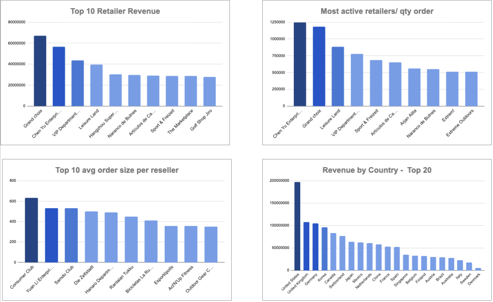
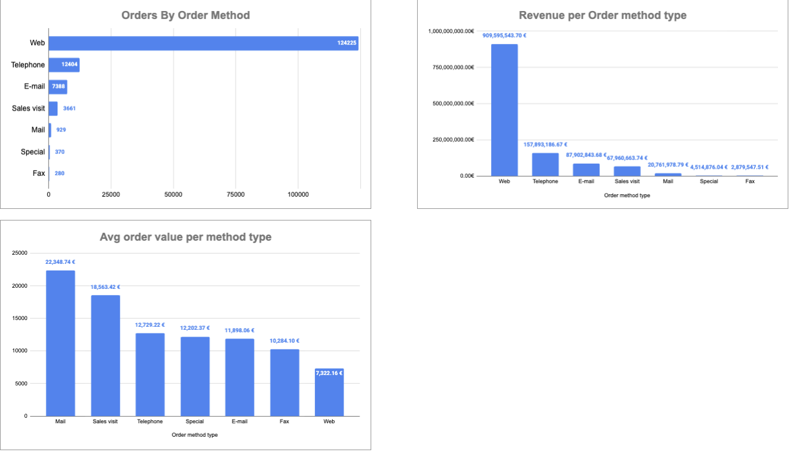
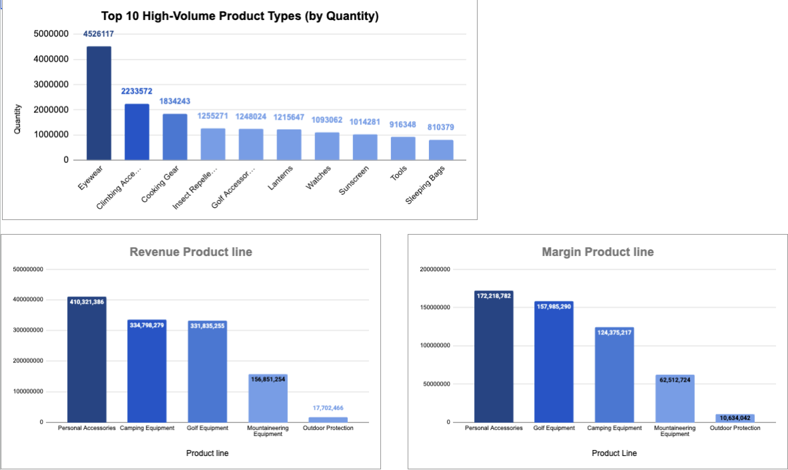
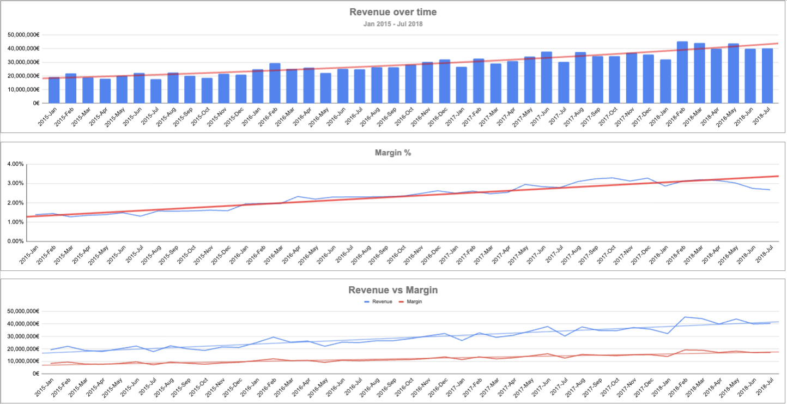
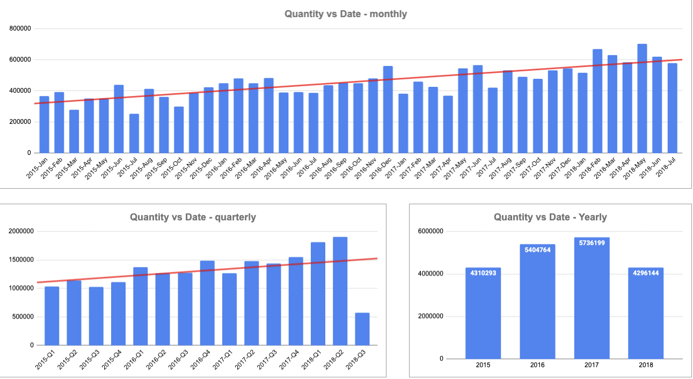
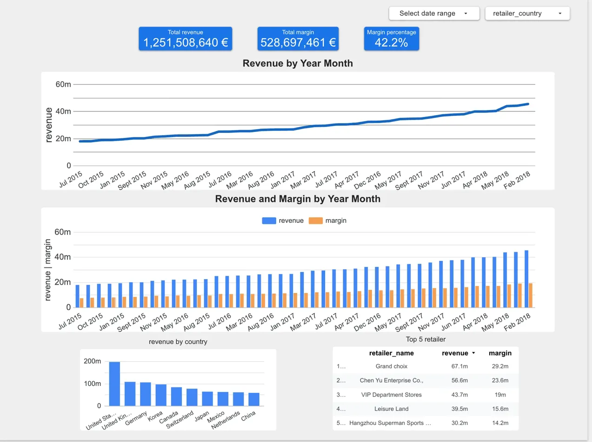
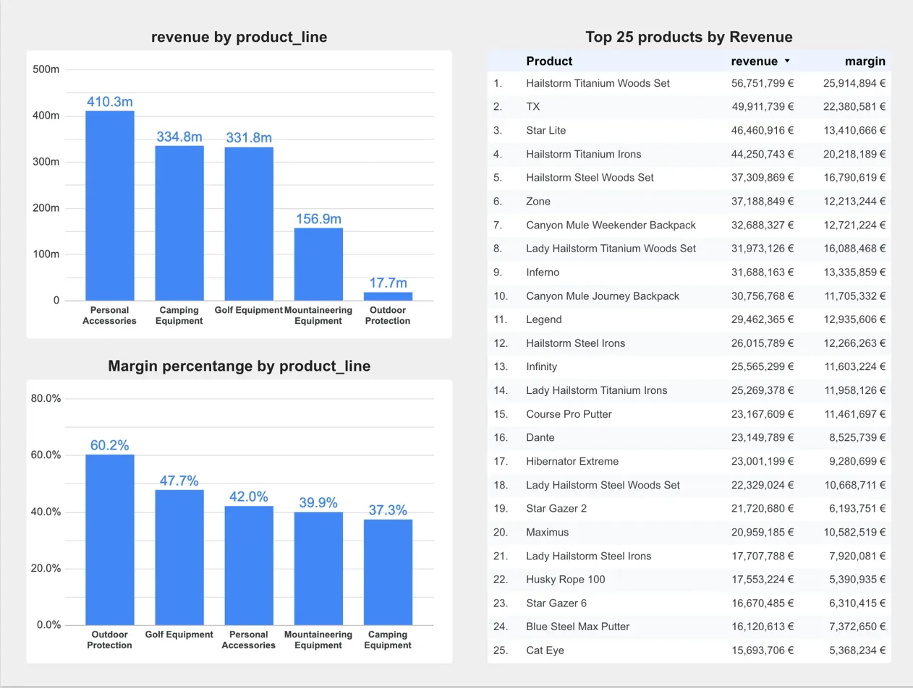
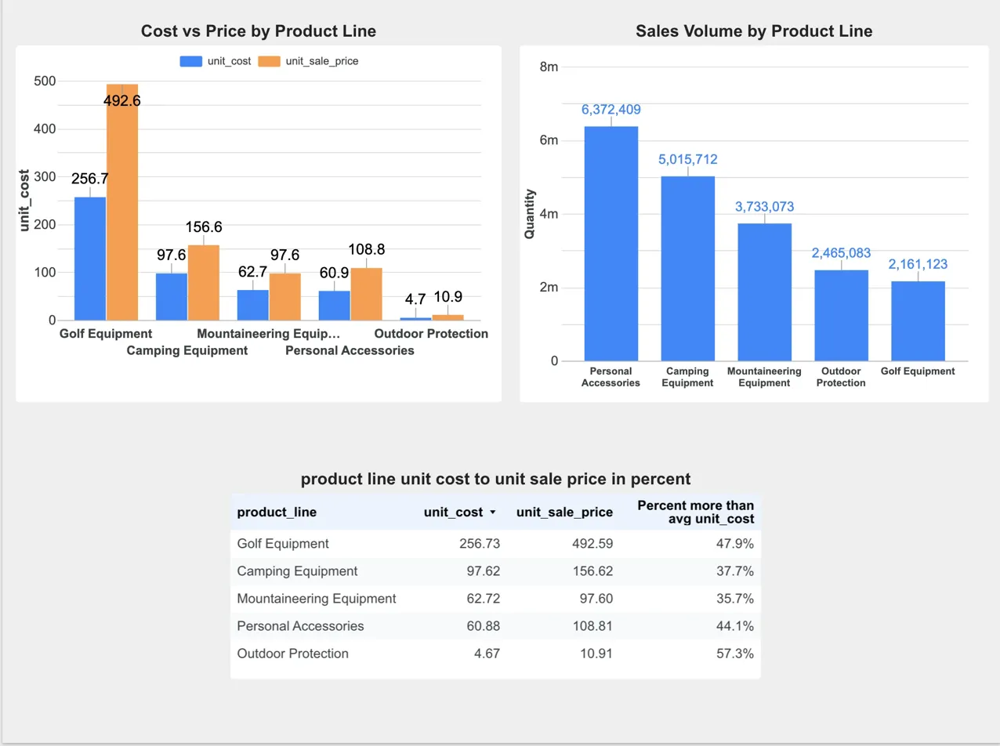
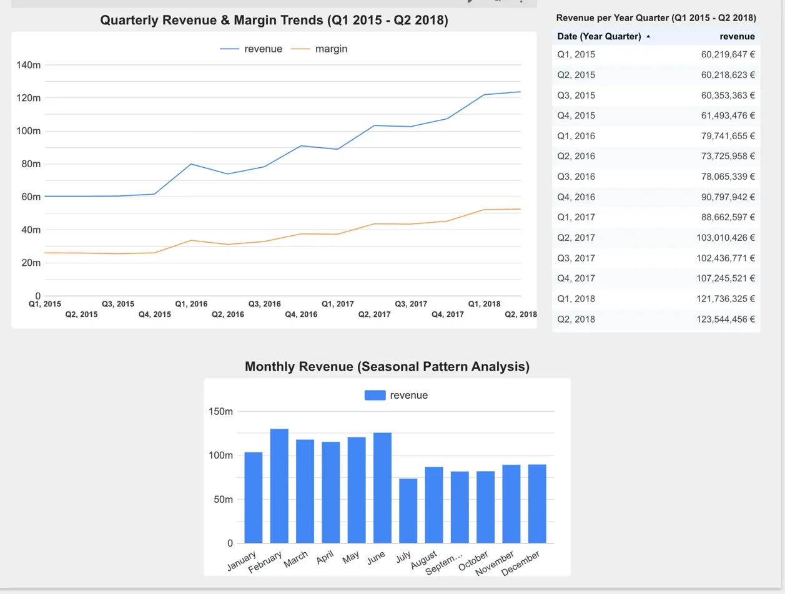

# GoExplore Retail Analytics

End-to-end retail analytics project using Google Sheets, BigQuery, and Looker Studio.  
Analyzing 149,000+ transactions to identify business performance and growth opportunities.

---

## Project Background

GoExplore is a camping and hiking equipment supplier. As the new data analyst, I was handed 
a single spreadsheet with raw data and tasked with delivering business insights within two weeks.

The data contained four related tables: orders, products, retailers, and order methods.  
No specific requirements were given — the goal was to explore the data and identify meaningful KPIs.

---

## Tools Used

| Tool | Purpose |
|------|---------|
| Google Sheets | Initial exploration, pivot tables, charts |
| Google BigQuery | Data warehouse, SQL queries, automated refresh |
| Looker Studio | Interactive dashboards for business stakeholders |

---

## Dataset

- 149,257 orders (January 2015 – July 2018)
- 561 retailers across 20+ countries
- 275 products across 5 product lines
- Total revenue: €1.25 billion

---

## KPIs Analyzed

- Total sales volume (monthly / seasonal / yearly)
- Total revenue (monthly / seasonal / yearly)
- High-revenue products and high-volume products
- High-performing product types
- Most active retailers and top retailers by revenue
- Average order size per retailer
- Revenue by country
- Orders by ordering method
- Average quantity per ordering channel

---

## Phase 1: Google Sheets

Used Google Sheets with VLOOKUP to combine all four source tables into a single 
analysis-ready dataset. Created dashboards covering retailer performance, channel 
analysis, and product portfolio.

**Retailer Analysis**  
Compares retailers across three dimensions: total revenue, order frequency, and 
average order value. Reveals different retailer strategies — some are high-volume, 
some are premium.

**Channel Analysis**  
Compares order methods by volume, revenue, and average order value. Key finding: 
traditional channels (mail, sales visits) have 3x higher average order values than 
web, despite low volume.

**Product Analysis**  
Shows product portfolio from three angles: units sold by product type, revenue by 
product line, and margin by product line.

---

## Phase 2: BigQuery + Google Sheets (Time-Series)

Moved the data to Google BigQuery to handle 149K rows more efficiently and enable 
automated refresh. Connected BigQuery back to Google Sheets for time-series charts.

SQL query: [master_data_query.sql](bigquery-sql/master_data_query.sql)

**Revenue and Margin Over Time**  
Monthly and quarterly views showing revenue growth from €20M to €43M per month 
(+117% over 3.5 years). Margin percentage improved from 1.4% to 3.3% — the 
business became more profitable, not just larger.

**Quantity and Seasonality**  
Monthly, quarterly, and yearly views of units sold. Clear seasonal pattern: 
peaks in February–June, dip in July.

---

## Phase 3: Looker Studio (Interactive Dashboard)

Built an interactive four-page dashboard in Looker Studio, connected directly to BigQuery.
Includes date range and country filters. Designed for different business stakeholders.

**Page 1 – Executive Overview**  
KPI scorecards (revenue, margin, margin %), revenue over time, geographic distribution, 
and top retailers. Designed for CFO and CEO.

**Page 2 – Product Portfolio**  
Revenue and margin percentage by product line. Key finding: Outdoor Protection has the 
highest margin (60.2%) but lowest revenue (€18M) — a significant growth opportunity.

**Page 3 – Pricing and Volume**  
Unit cost vs. unit sale price by product line, volume by product line, and detailed 
unit economics table. Designed for pricing and product strategy teams.

**Page 4 – Time Trends**  
Quarterly revenue and margin trends, quarterly revenue table, and monthly seasonality 
pattern. Designed for operations and planning teams.

---

## Key Findings

1. **Revenue doubled** over 3.5 years (€20M → €43M per month)
2. **Margin percentage improved** from 1.4% to 3.3% — growth is profitable, not just volume
3. **Outdoor Protection** has a 60.2% margin but only €18M revenue — largest untapped opportunity
4. **Traditional order channels** (mail, sales visits) have the highest average order value despite low volume
5. **Strong seasonality**: February–June peaks, July dip — important for inventory and staffing planning

---

## Strategic Recommendations

1. **Expand Outdoor Protection** — highest margin category (60%), lowest revenue (1%). A 50% increase adds ~€9M revenue and ~€5M margin.
2. **Plan around seasonality** — stock inventory in December–January, plan promotions for July slowdown.
3. **Maintain traditional channels** — low volume but highest-value customers. Do not cut for cost savings.

---

## About This Project

This project was completed as part of a Data Analytics Weiterbildung.  
It demonstrates a full analytics workflow: data modeling, SQL, business intelligence, and stakeholder communication.
